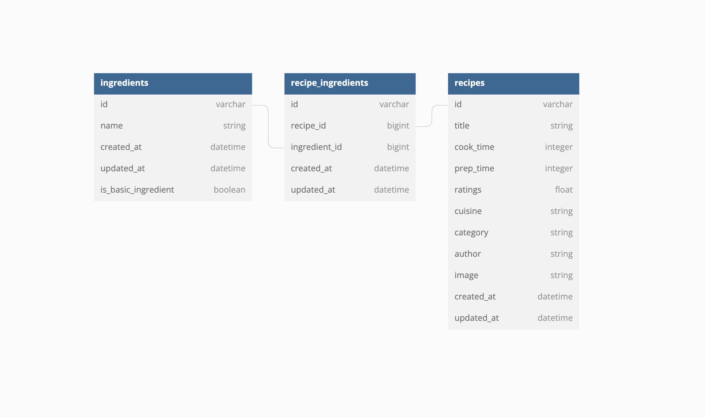

# FIND AND COOK

A Simple prototype recipe finder app for quick cooking with what you have

##### Prerequisites

The setups steps expect following tools installed on the system.

- Github
- Ruby [3.1.0]
- Rails [6.1]

##### 1. Check out the repository

```bash
git clone https://github.com/steliosCharizanis/find_recipe_app.git\
cd find_recipe_app
```

##### 2. Install dependencies

```bash
bundle install
yarn install
```

##### 3. Create and setup the database

Run the following commands to create and setup the database.

```bash
rails db:create db:migrate
```



##### 4. Initialize/Import data

Run the following commands to import data.

```ruby
rake import:ingredients import:recipes import_associations:recipe_ingredients
```

##### 4. Start the Rails server

You can start the rails server using the command given below.

```ruby
rails s
```

##### 5. Start Webpack dev server

You can start the webpack react dev server using the command given below.

```bash
./bin/webpack-dev-server
```

And now you can visit the site with the URL http://localhost:3000

##### 6. Running unit tests

You can run specs using the command given below

```bash
rspec spec/models/recipe_spec.rb spec/models/ingredient_spec.rb spec/requests/recipes_spec.rb
```

##### 7. Production demo url

You can visit the demo for the app at the following url

https://find-and-cook-app.herokuapp.com/
